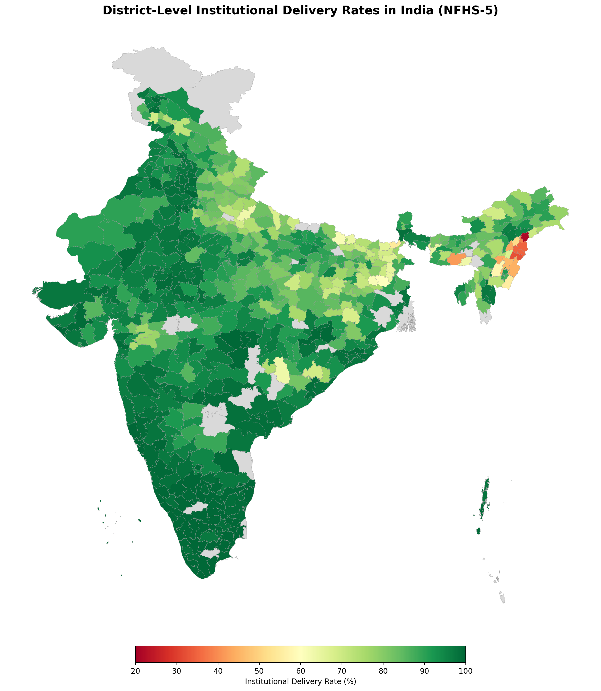

# District-Level Disparities in Maternal Healthcare Access Across India
## A Policy Analysis Using NFHS-5 (2019–21)

**Author:** Kaushal Kumar · MA Economics, Ashoka University

---

## Overview

This project analyzes **why institutional delivery rates vary across 707 Indian districts**, identifies the socioeconomic determinants driving these disparities, and produces a policy-priority district list for targeted intervention.

India's institutional delivery rate averages 88.7% nationally, but ranges from **21.4% to 100%** across districts — a gap that translates directly into preventable maternal deaths.

## Key Findings

| Finding | Detail |
|---------|--------|
| **Female literacy** is the strongest predictor | 10pp increase → 3.3pp higher institutional delivery (p<0.01) |
| **State-level policy** explains most variation | R² jumps from 0.34 to 0.75 with state fixed effects |
| **Health insurance** has independent within-state effect | Coefficient *increases* after adding state FE (0.137***) |
| **Clean fuel access** proxies household modernization | Second-strongest predictor (0.161***) |
| **Child marriage** has no independent district-level effect | Insignificant in all specifications with controls |

## Methodology

**Data:** NFHS-5 district factsheets (707 districts, 36 states/UTs) from SSRN aggregated dataset.

**Models:**
1. **Bivariate OLS** — institutional delivery ~ female literacy
2. **Multiple OLS** — adds child marriage, health insurance, improved sanitation, clean fuel
3. **State Fixed Effects OLS** — controls for unobserved state-level policy heterogeneity

All models use **robust standard errors (HC1)** to address heteroskedasticity. Diagnostics include VIF, Breusch-Pagan, and RESET tests.

## Visualizations

| Output | Description |
|--------|-------------|
| `outputs/map_institutional_delivery.png` | Choropleth — institutional delivery rates across all 707 districts |
| `outputs/01_indicator_distributions.png` | Distribution of 4 key maternal health indicators |
| `outputs/02_state_comparison.png` | State-wise average institutional delivery (bar chart) |
| `outputs/03_correlation_matrix.png` | Correlation heatmap across health indicators |
| `outputs/04_scatter_literacy_vs_delivery.png` | Scatter + trendline — female literacy vs institutional delivery |

<p align="center">
  
</p>

## Project Structure

```
MATERNAL_HEALTH/
├── README.md
├── requirements.txt
├── .gitignore
│
├── data/                          # NOT tracked in git (see .gitignore)
│   ├── ssrn_datasheet.xls         # NFHS-5 district data (707 districts)
│   └── india_district_shapefile/  # Census 2011 district boundaries
│       ├── 2011_Dist.shp
│       ├── 2011_Dist.dbf
│       ├── 2011_Dist.shx
│       └── 2011_Dist.prj
│
├── notebooks/
│   ├── 01_Data_load.ipynb         # Data loading, cleaning, descriptive stats
│   ├── 02_regression_analysis.ipynb  # OLS regression (3 models + diagnostics)
│   └── 03_choropleth.ipynb        # Choropleth map + bottom 30 districts
│
├── outputs/
│   ├── map_institutional_delivery.png
│   ├── 01_indicator_distributions.png
│   ├── 02_state_comparison.png
│   ├── 03_correlation_matrix.png
│   ├── 04_scatter_literacy_vs_delivery.png
│   ├── bottom_30_priority_districts.csv
│   ├── nfhs5_maternal_state_means.csv
│   └── nfhs5_analysis_ready.csv
│
└── docs/
    └── regression_interpretation.md  # Full write-up of regression findings
```

## How to Reproduce

```bash
# Clone
git clone https://github.com/YOUR_USERNAME/maternal-health-nfhs5.git
cd maternal-health-nfhs5

# Install dependencies
pip install -r requirements.txt

# Download data (not tracked in git)
# 1. NFHS-5 district data: https://papers.ssrn.com/sol3/papers.cfm?abstract_id=3799566
# 2. District shapefile: https://github.com/datameet/maps/tree/master/Districts
# Place in data/ folder

# Run notebooks in order
jupyter notebook notebooks/01_Data_load.ipynb
jupyter notebook notebooks/02_regression_analysis.ipynb
jupyter notebook notebooks/03_choropleth.ipynb
```

## Model Results Summary

```
                              M1 (Bivariate)   M2 (Controls)   M3 (State FE)
──────────────────────────────────────────────────────────────────────────────
female_literacy                     0.274***        0.145***        0.330***
child_marriage                           —          -0.008           0.002
health_insurance                         —          0.121***        0.137***
improved_sanitation                      —         -0.160***        -0.057
clean_fuel                               —          0.277***        0.161***
──────────────────────────────────────────────────────────────────────────────
R-squared                           0.078           0.341           0.754
N                                     707             707             707
```

*** p<0.01. Robust (HC1) standard errors.

## Policy Implications

1. **Female literacy investments** yield the strongest returns in maternal health outcomes — co-target low-literacy districts with maternal health programs
2. **Interstate disparities** in JSY/NHM implementation are the dominant driver — national policy should focus on reducing state-level implementation gaps
3. **Health insurance expansion** (Ayushman Bharat) shows independent within-state effects on institutional delivery
4. **Cross-sectoral convergence** between energy access (Ujjwala Yojana), sanitation (Swachh Bharat), and maternal health programs can amplify outcomes

## Policy Frameworks Referenced

JSY (Janani Suraksha Yojana) · NHM (National Health Mission) · Ayushman Bharat · LaQshya · POSHAN Abhiyaan · SDG 3.1, 3.7, 3.8

## Data Sources

- **NFHS-5 District Factsheets:** Ministry of Health and Family Welfare, Government of India (2019–21)
- **District Shapefile:** Census of India 2011 via [DataMeet](https://github.com/datameet/maps)

## Tools

Python (pandas, statsmodels, matplotlib, pyshp, numpy) · Jupyter Notebook

## Future Work

- Individual-level logistic regression using DHS microdata (IR file) — pending access approval
- Concentration index for wealth-based inequality decomposition
- NFHS-4 vs NFHS-5 comparison for improvement trajectory analysis

---

## License

This project is for academic and research purposes. Data is sourced from publicly available government surveys.